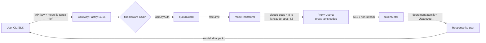
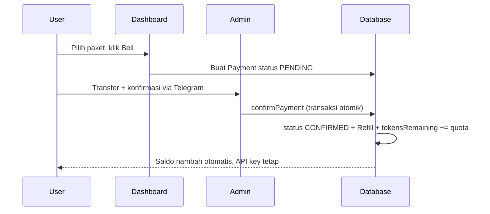
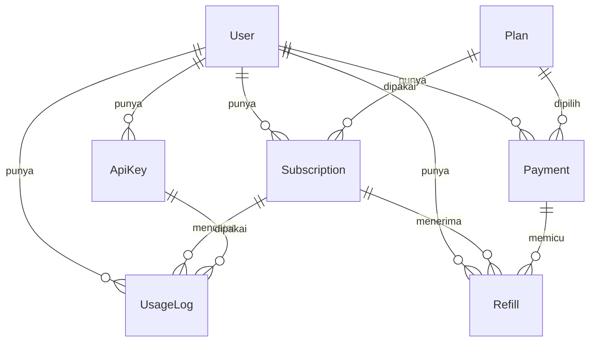

# TamsHub ClaudProx

Gateway reseller proxy AI yang menjual akses ke model Claude (dan model partner lain) dengan model bisnis kuota token plus durasi waktu. Sistem menembak ke proxy utama, memberi metering token akurat, rate limit per langganan, transformasi model id, dan otentikasi via API key.

> Akses semua model Claude (Haiku, Sonnet, Opus) plus model lain. Konteks hingga 1M token, SSE streaming, harga hemat.

---

## Ringkasan Produk

TamsHub ClaudProx adalah produk SaaS yang terdiri dari empat layanan utama:

- **Gateway reseller (Fastify)** yang menembak ke proxy utama, memberi metering token, rate limit, transformasi model id, dan otentikasi API key.
- **Landing + Docs** (`claudprox.tams.codes`) untuk marketing, dokumentasi, dan panduan integrasi 18 CLI tool.
- **Dashboard user** (`dashboard.claudprox.tams.codes`) untuk melihat saldo token, hari tersisa, statistik request, API key, dan beli/refill paket.
- **Dashboard admin** (`admin.claudprox.tams.codes`) untuk memantau seluruh user, request, token, pembayaran, dan verifikasi pembayaran manual.

Target pengguna: developer yang ingin akses model Claude premium lewat CLI tool atau SDK existing (OpenAI/Anthropic-compatible) dengan harga terjangkau, tanpa perlu langganan resmi per-vendor.

---

## Arsitektur



Alur billing manual-confirm:



Skema database:



---

## Tech Stack

- **Monorepo**: pnpm workspaces.
- **Frontend**: Next.js 14 (App Router) + Tailwind CSS, tema CtOS.
- **Gateway**: Fastify (terpisah dari Next.js).
- **ORM/DB**: Prisma + MySQL.
- **Bahasa**: TypeScript strict mode di seluruh paket.
- **Deployment**: PM2 (process manager) + Nginx (reverse proxy) + Certbot (SSL), self-host VPS.

---

## Struktur Folder

```
claudprox/
├── package.json                 # root, pnpm workspaces
├── pnpm-workspace.yaml
├── ecosystem.config.js          # konfigurasi PM2 (4 service)
├── tsconfig.base.json
├── prisma/
│   ├── schema.prisma            # source of truth schema
│   ├── migrations/              # migrasi init MySQL
│   └── seed.ts                  # seed 3 plan + 1 admin
├── packages/
│   ├── shared/                  # tipe domain + peta model (52 model kr/)
│   │   └── src/
│   │       ├── types.ts
│   │       ├── model-map.ts     # MODEL_MAP reversible
│   │       └── constants.ts     # PLAN_DEFINITIONS
│   └── server/                  # auth + apiKey + billing (dipakai 3 web app)
│       └── src/
│           ├── apiKey.ts        # generate/hash key cpx_live_
│           ├── password.ts      # bcrypt cost 12
│           ├── auth.ts          # JWT access/refresh, RBAC
│           └── billing.ts       # confirmPayment atomik idempoten
├── apps/
│   ├── gateway/                 # Fastify proxy reseller (port 4015)
│   │   └── src/
│   │       ├── server.ts
│   │       ├── routes/          # v1-models, v1-chat, v1-messages, health
│   │       ├── middleware/      # apiKeyAuth, quotaGuard, rateLimit
│   │       └── lib/             # upstream, tokenMeter, modelTransform, sseProxy
│   ├── web-landing/             # Domain 1: claudprox.tams.codes (port 4016)
│   ├── web-dashboard/           # Domain 2: dashboard (port 4017)
│   └── web-admin/               # Domain 3: admin (port 4018)
├── deploy/nginx/                # 4 server block + README install
└── scripts/cloudflare-dns.ts    # setup DNS idempoten
```

---

## Quick Start (lokal)

### Prasyarat

- Node.js 20 LTS
- pnpm 8+
- MySQL 8 berjalan di `127.0.0.1:3306`

### Langkah

```bash
# 1. Install dependency
pnpm install

# 2. Setup environment (copy dari contoh, isi nilai sebenarnya)
cp .env.example .env
# Edit .env: isi DATABASE_URL, UPSTREAM_PROXY_API_KEY, JWT_SECRET, dll.

# 3. Migrasi database + seed
pnpm prisma migrate deploy
pnpm prisma db seed

# 4. Jalankan tiap app (terminal terpisah)
pnpm --filter @claudprox/gateway dev      # port 4015
pnpm --filter web-landing dev             # port 4016
pnpm --filter web-dashboard dev           # port 4017
pnpm --filter web-admin dev               # port 4018
```

---

## Environment Variables

Lihat `.env.example` untuk daftar lengkap. Variabel utama:

| Variabel | Keterangan |
|----------|------------|
| `NODE_ENV` | `production` di server |
| `APP_BASE_URL` | URL landing |
| `DASHBOARD_USER_URL` | URL dashboard user |
| `DASHBOARD_ADMIN_URL` | URL dashboard admin |
| `UPSTREAM_PROXY_BASE_URL` | `https://proxy.tams.codes` |
| `UPSTREAM_PROXY_API_KEY` | key upstream (dari enumerasi, JANGAN dikarang) |
| `DATABASE_URL` | koneksi MySQL Prisma |
| `JWT_SECRET` | secret JWT access token |
| `JWT_REFRESH_SECRET` | secret JWT refresh token |
| `SESSION_SECRET` | secret session |
| `APIKEY_HASH_SECRET` | secret hash API key (`sha256(key+secret)`) |
| `CLOUDFLARE_API_TOKEN` | token DNS Cloudflare |
| `CLOUDFLARE_ZONE_ID` | zone id `tams.codes` |
| `GITHUB_TOKEN` | token repo |

Semua secret HANYA di `.env` (gitignored). Tidak pernah di-commit, tidak pernah dikirim ke browser, tidak pernah di-`console.log`.

---

## Endpoint Gateway

Base URL produksi: `https://api.claudprox.tams.codes`

### `GET /v1/models`

Daftar 52 model whitelist (id versi user, tanpa prefix `kr/`).

```bash
curl https://api.claudprox.tams.codes/v1/models \
  -H "Authorization: Bearer <API_KEY_KAMU>"
```

### `POST /v1/chat/completions` (OpenAI-compatible)

```bash
curl -X POST https://api.claudprox.tams.codes/v1/chat/completions \
  -H "Authorization: Bearer <API_KEY_KAMU>" \
  -H "Content-Type: application/json" \
  -d '{
    "model": "claude-opus-4-8",
    "messages": [{"role": "user", "content": "Halo"}],
    "stream": false
  }'
```

### `POST /v1/messages` (Anthropic-compatible)

```bash
curl -X POST https://api.claudprox.tams.codes/v1/messages \
  -H "x-api-key: <API_KEY_KAMU>" \
  -H "anthropic-version: 2023-06-01" \
  -H "Content-Type: application/json" \
  -d '{
    "model": "claude-opus-4-8",
    "max_tokens": 256,
    "messages": [{"role": "user", "content": "Halo"}]
  }'
```

### `GET /health`

Health check internal, tidak butuh API key.

Semua endpoint `/v1/*` (kecuali health) melewati: `apiKeyAuth` → `quotaGuard` → `rateLimit` → `modelTransform` → handler.

---

## Paket Harga

| Paket | Token | Durasi | Harga | Rate Limit |
|-------|-------|--------|-------|------------|
| Starter | 20.000.000 | 3 hari | Rp30.000 | 60 RPM |
| Pro | 100.000.000 | 6 hari | Rp50.000 | 120 RPM |
| Ultra | 300.000.000 | 14 hari | Rp120.000 | 240 RPM |

Pembayaran lewat QRIS, BCA, atau Virtual Account. Konfirmasi manual via Telegram admin. Setelah admin approve, saldo token nambah otomatis ke API key yang sama (tidak perlu generate key baru).

---

## 18 CLI Tools Terintegrasi

Setiap tool punya panduan koneksi di landing page (grid kartu + modal pop-up dengan tombol copy):

1. Claude Code
2. OpenClaw
3. Codex CLI
4. OpenCode
5. Cursor
6. Antigravity
7. Cline
8. Continue
9. Droid
10. Roo Code
11. GitHub Copilot
12. Kilo Code
13. Gemini CLI
14. Qwen Code
15. iFlow
16. Crush
17. Crusher
18. Aider

Tool yang tidak mendukung custom base URL (Copilot resmi, Gemini CLI resmi) ditandai jujur dengan catatan keterbatasan.

---

## Deploy (VPS)

Server target: `168.144.107.144`.

### Urutan deploy

1. SSH ke server, verifikasi `whoami`.
2. Clone/pull repo ke `/root/work/claudprox`.
3. `pnpm install`.
4. Setup `.env` di server (transfer aman, jangan commit).
5. MySQL: buat database `claudprox`, `pnpm prisma migrate deploy`, `pnpm prisma db seed`.
6. Build: `pnpm --filter @claudprox/gateway build` + `pnpm --filter web-* build`.
7. PM2: `pm2 start ecosystem.config.js && pm2 save && pm2 startup`.
8. Nginx: copy `deploy/nginx/*.conf` ke sites-available, symlink ke sites-enabled, `nginx -t`, reload.
9. Cloudflare DNS: `pnpm dlx tsx scripts/cloudflare-dns.ts`.
10. Certbot: terbitkan SSL untuk 4 domain.
11. Smoke test: `curl -I` tiap domain.

Detail Nginx (termasuk konfigurasi SSE-friendly untuk gateway) ada di `deploy/nginx/README.md`.

### Aturan port

| Service | Port |
|---------|------|
| gateway | 4015 |
| web-landing | 4016 |
| web-dashboard | 4017 |
| web-admin | 4018 |

Semua di balik Nginx, user akses via domain port 443.

---

## Testing

Unit test (Vitest):

```bash
# Gateway: modelTransform, quotaGuard, apiKeyAuth, tokenMeter, rateLimit, v1-models
cd apps/gateway && pnpm exec vitest run     # 33 test

# Server: apiKey, password, auth, billing
cd packages/server && pnpm exec vitest run  # 26 test
```

Build verification:

```bash
cd apps/web-landing && pnpm exec next build    # exit 0
cd apps/web-dashboard && pnpm exec next build  # exit 0
cd apps/web-admin && pnpm exec next build      # exit 0
```

---

## Keamanan

- Password di-hash dengan bcrypt cost 12.
- API key disimpan sebagai hash (`sha256(key + APIKEY_HASH_SECRET)`), plaintext hanya ditampilkan sekali.
- Endpoint admin cek `role=ADMIN` di server, bukan hanya hide di UI.
- Cookie httpOnly + sameSite=lax + secure (production). Cookie user dan admin terpisah.
- Decrement saldo dan refill atomik via Prisma `$transaction`, idempoten (no double refill, no saldo negatif).
- Secret tidak pernah di-commit, tidak pernah dikirim ke client.

---

## Kontak

- Telegram: [t.me/ImTamaa](https://t.me/ImTamaa)
- Email: admin@tams.codes
- GitHub: [github.com/el-pablos](https://github.com/el-pablos)

---

## Lisensi

Proprietary. All rights reserved by TamsHub.
